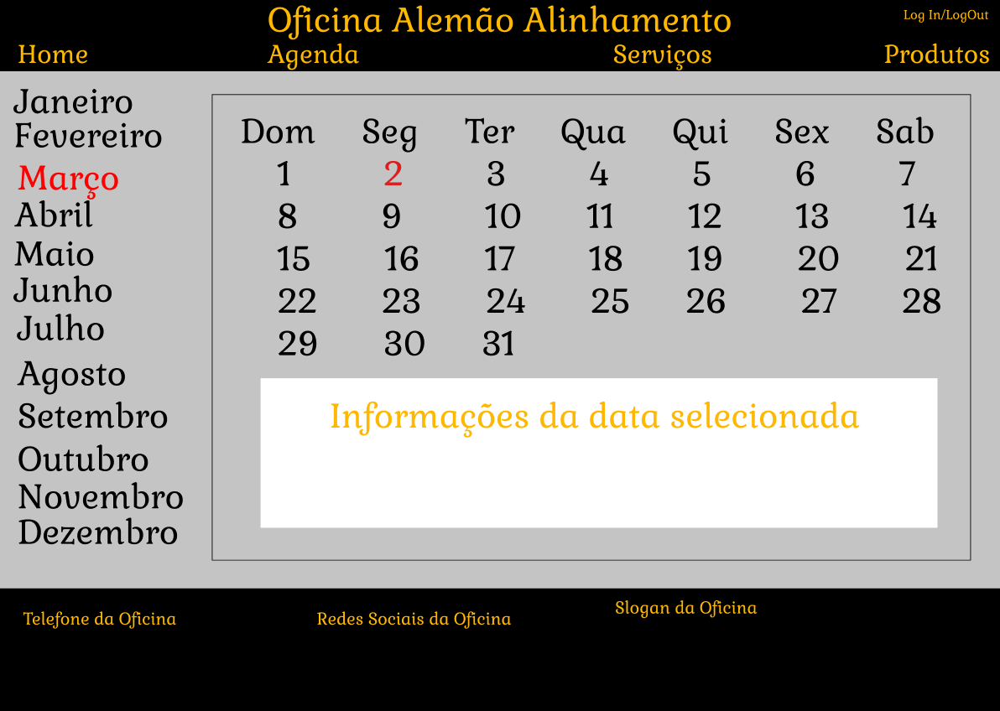

# Interface de usuário 1 - Agenda

## 1. Leiaute sugerido

## 2. Relacionamentos com outras interfaces

Esta interface permite atravez dos meses navegar sobre os dias e ao selecionar os dias aparecerá suas informações e detalhes sobre os trabalhos e agendamentos do dia.
També é possivel, através do header, uma navegação com as outras páginas, apenas ao clicar na indicação.

## 3. Comandos

| **Número** | **Nome** | **Ação** | **Restrições** |
| --- | --- | --- | --- |
|1. | Home | Uma indicação presente no header que quando clicada leva até a página inicial do site da oficina | --não possui-- |
|2. | Quem Somos | Uma indicação no header que quando clicada leva até a página de informações da oficina | --não possui-- |
|3. | Serviços | Uma indicação no header que quando clicada leva até a página de serviços oferecidos pela oficina | --não possui-- |
|4. | Produtos | Uma indicação na parte superior que quando clicada leva até a página de produtos a venda da oficina | --não possui-- |
|5. | Log In/Log Out | Uma indicação na parte superior que quando clicada leva até a página de Log In ou quando já logado o usuário pode fazer o Log Out da sua conta | --não possui-- |
|6.|Meses|Todos os meses estão alinhados na vertical a esquerda da tela e quando selecionados, mostrarão os respectivos dias de cada mes|--não possui--|
|7.|Dias|Todos os dias estão posicionados ao centro da tela e ao selecionar um deles, é possivel ver o que tem pra fazer em cada um deles, seja os trabalhos ou agendamentos|--não possui--|

