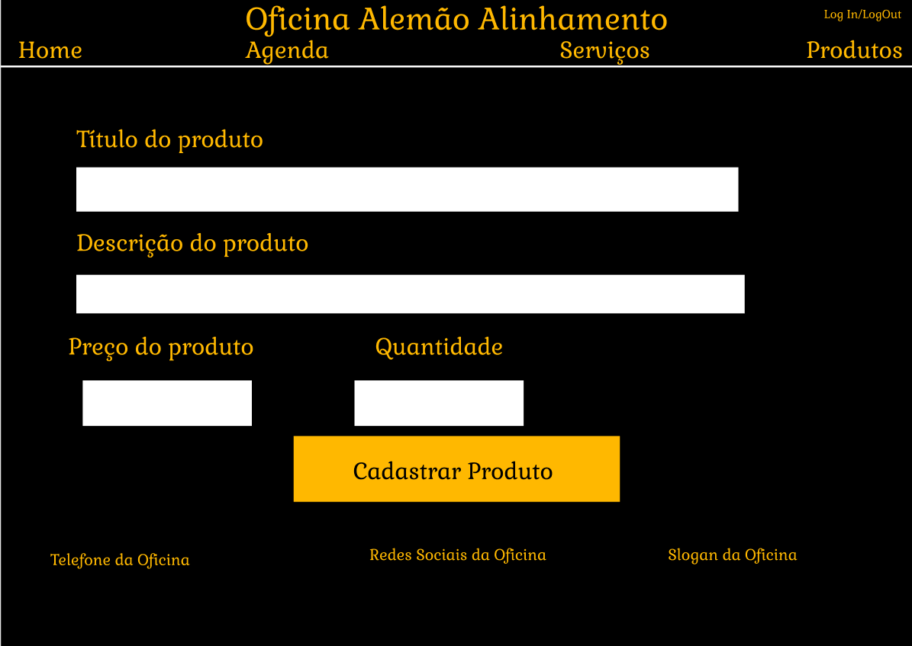

# Interface de usuário 2 - Cadastro Produto

## 1. Leiaute sugerido

## 2. Relacionamentos com outras interfaces

Esta interface permite através do header, uma navegação com as outras páginas, apenas ao clicar na indicação. E com o Botão "Cadastrar" levará o usuário até a tela da Home

## 3. Campos

| **Número** | **Nome** | **Descrição** | **Valores válidos** | **Formato** | **Tipo** | **Restrições** |
| --- | --- | --- | --- | --- | --- | --- |
|1. | Titulo do Produto | O nome que aparecerá no anuncio e acima da descrição | Somente Caracteres | Texto | String | --não possui-- |
|2. | Descrição do Produto | A descrição que irá aparecer quando o produto escolhido for selecionado | Somente Caracteres | Texto | String | --não possui-- |
|3. | Preço do Produto | O valor que sera mostrado ao cliente quando selecionar o produto e o que será cobrado quando for a hora do pagamento | Somente Numeros | Valor | Float | Letras|
|4. |Quantidade | Quantidade de produtos disponiveis no estoque | Somente numeros |Valor | int | Letras e caracteres que não sejam numeros |

## 4. Comandos

| **Número** | **Nome** | **Ação** | **Restrições** |
| --- | --- | --- | --- |
|1. | Home | Uma indicação presente no header que quando clicada leva até a página inicial do site da oficina | --não possui-- |
|2. | Quem Somos | Uma indicação no header que quando clicada leva até a página de informações da oficina | --não possui-- |
|3. | Serviços | Uma indicação no header que quando clicada leva até a página de serviços oferecidos pela oficina | --não possui-- |
|4. | Produtos | Uma indicação na parte superior que quando clicada leva até a página de produtos a venda da oficina | --não possui-- |
|5. | Log In/Log Out | Uma indicação na parte superior que quando clicada leva até a página de Log In ou quando já logado o usuário pode fazer o Log Out da sua conta | --não possui-- |
