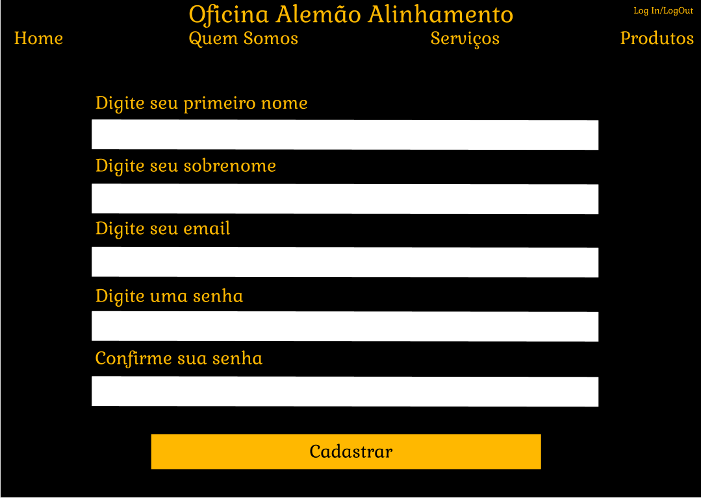

# Interface de usuário NUM - Cadastro

## 1. Leiaute sugerido

## 2. Relacionamentos com outras interfaces

Esta interface permite atravez do header, uma navegação com as outras paginas, apenas ao clicar na indicação. E com o Botão "Cadastrar" levará o usuario até a tela da Home

## 3. Campos

| **Número** | **Nome** | **Descrição** | **Valores válidos** | **Formato** | **Tipo** | **Restrições** |
| --- | --- | --- | --- | --- | --- | --- |
|1. | Home | Uma indicação presente no header que quando clicada leva até a pagina inicial do site da oficina | Click | Hiperlink | Onclick | --não possui-- |
|2. | Quem Somos | Uma indicação no header que quando clicada leva ate a pagina de informações da oficina | Click | Hiperlink | Onclick | --não possui-- |
|3. | Serviços | Uma indicação no header que quando clicada leva ate a pagina de serviços oferecidos pela oficina | Click | Hiperlink | Onclick | --não possui-- |
|4. | Produtos | Uma indicação na parte superior que quando clicada leva ate a pagina de produtos a venda da oficina | Click | Hiperlink | Onclick | --não possui-- |
|5. | Log In/Log Out | Uma indicação na parte superior que quando clicada leva ate a pagina de Log In ou quando ja logado o usuario pode fazer o Log Out da sua conta | Click | Hiperlink | Onclick | --não possui-- |
|6. | Nome | Espaço para o usuario inserir seu nome | Somente letras | Texto | String | não é permitido numeros ou caracteres fora do alfabeto |
|7. | Sobrenome | Espaço para o usuario inserir seu sobrenome | Somente letras | Texto | String | não é permitido numeros ou caracteres fora do alfabeto |
|8. | Email | Espaço para o usuario inserir seu email valido | Todos | Texto | String | Necessario inserir ao menos o"@" |
|9. | Senha | Espaço para o usuario inserir sua senha valida | Todos | Texto | String | Necessario possuir ao menos uma letra maiuscula e um numero |
|10. | Confirmar Senha | Espaço para o usuario inserir sua senha igual ao Campo anterior | Todos | Texto | String | Necessario ser exatamente igual a senha inserida no campo anterior |

## 4. Comandos

| **Número** | **Nome** | **Ação** | **Restrições** |
| --- | --- | --- | --- |
|1. | Cadastrar | Analisará todas as informações recebidas nos campos "Nome", "Sobrenome", "Email", "Senha" e "Confirmar Senha" para verem se estão corretas e após isso criara uma conta para o usuario.|  Caso as informações apresentem erros, o processo não sera concluido e será demandado ao usuario para refaze-lo  |
|2. | | | |
|3. | | | |
|4. | | | |
|5. | | | |
|6. | | | |
|7. | | | |
|8. | | | |
|9. | | | |
|10. | | | |

