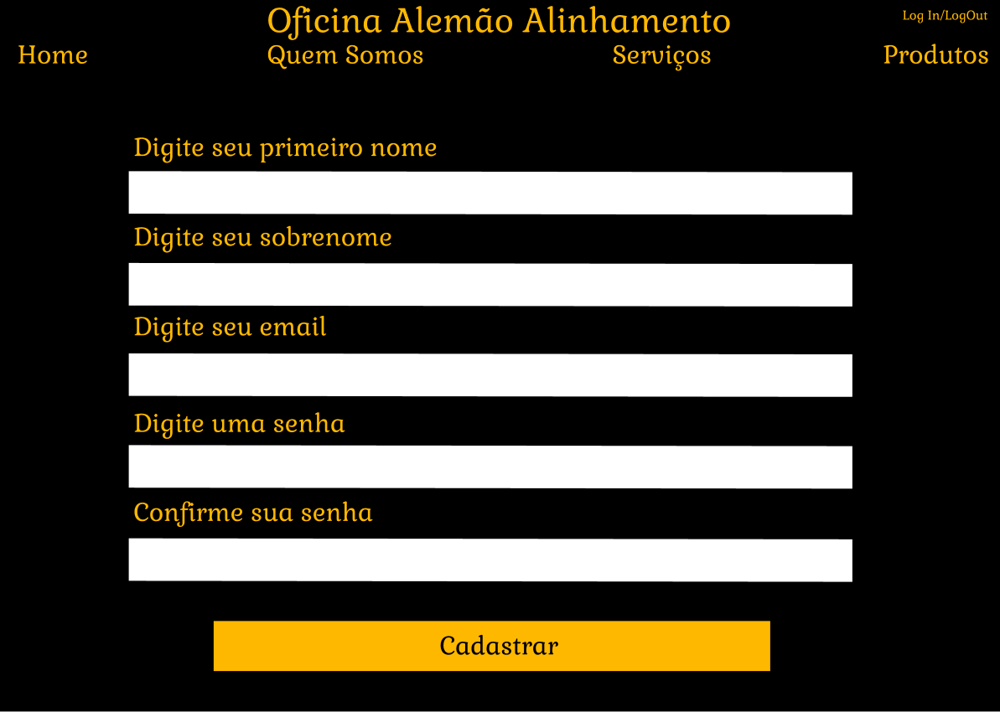

# Interface de usuário 5 - Cadastro

## 1. Leiaute sugerido

## 2. Relacionamentos com outras interfaces

Esta interface permite através do header, uma navegação com as outras páginas, apenas ao clicar na indicação. E com o Botão "Cadastrar" levará o usuário até a tela da Home

## 3. Campos

| **Número** | **Nome** | **Descrição** | **Valores válidos** | **Formato** | **Tipo** | **Restrições** |
| --- | --- | --- | --- | --- | --- | --- |
|1. | Preencher Nome | Espaço para o usuário inserir seu nome | Somente letras | Texto | String | Não é permitido números ou caracteres fora do alfabeto |
|2. | Preencher Sobrenome | Espaço para o usuário inserir seu sobrenome | Somente letras | Texto | String | Não é permitido números ou caracteres fora do alfabeto |
|3. | Preencher Email | Espaço para o usuário inserir seu email válido | Todos | Texto | String | Necessário inserir ao menos o"@" e o ".com" |
|4. | Preencher Senha | Espaço para o usuário inserir sua senha válida | Todos | Texto | String | Necessário possuir ao menos uma letra maiúscula e um número |
|5. | Preencher Confirmar Senha | Espaço para o usuário inserir sua senha igual ao Campo anterior | Todos | Texto | String | Necessário ser exatamente igual a senha inserida no campo anterior |

## 4. Comandos

| **Número** | **Nome** | **Ação** | **Restrições** |
| --- | --- | --- | --- |
|1. | Cadastrar | Analisará todas as informações recebidas nos campos "Nome", "Sobrenome", "Email", "Senha" e "Confirmar Senha" para verem se estão corretas e após isso criará uma conta para o usuário.|  Caso as informações apresentem erros, o processo não será concluído e será demandado ao usuário para refazê-lo  |
|2. | Home | Uma indicação presente no header que quando clicada leva até a página inicial do site da oficina | --não possui-- |
|3. | Quem Somos | Uma indicação no header que quando clicada leva até a página de informações da oficina | --não possui-- |
|4. | Serviços | Uma indicação no header que quando clicada leva até a página de serviços oferecidos pela oficina | --não possui-- |
|5. | Produtos | Uma indicação na parte superior que quando clicada leva até a página de produtos a venda da oficina | --não possui-- |
|6. | Log In/Log Out | Uma indicação na parte superior que quando clicada leva até a página de Log In ou quando já logado o usuário pode fazer o Log Out da sua conta | --não possui-- |

