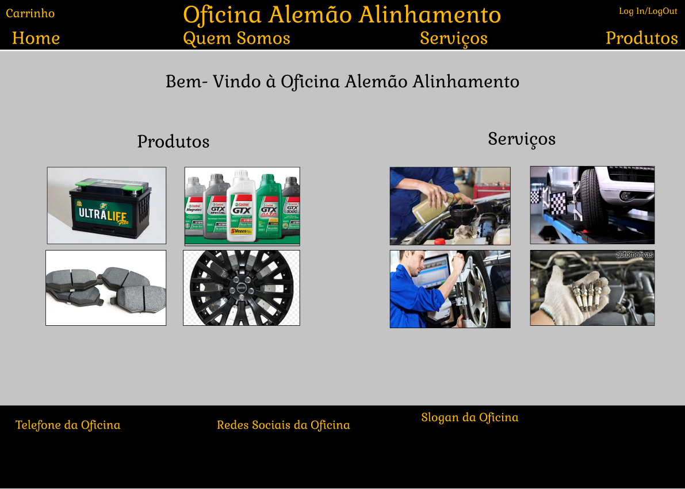

# Interface de usuário NUM - Home

## 1. Leiaute sugerido

## 2. Relacionamentos com outras interfaces

A interface "Home", será o ponto inicial do site, ou seja, a primeira interface acessada pelo usuário sera ela, e será nela que após o cadastro o usuário será enviado.
Esta interface permite através do header, uma navegação com as outras paginas, apenas ao clicar na indicação.

## 3. Campos

| **Número** | **Nome** | **Descrição** | **Valores válidos** | **Formato** | **Tipo** | **Restrições** |
| --- | --- | --- | --- | --- | --- | --- |
|1. | Home | Uma indicação presente no header que quando clicada leva até a página inicial do site da oficina | Click | Hiperlink | Onclick | --não possui-- |
|2. | Quem Somos | Uma indicação no header que quando clicada leva até a página de informações da oficina | Click | Hiperlink | Onclick | --não possui-- |
|3. | Serviços | Uma indicação no header que quando clicada leva até a página de serviços oferecidos pela oficina | Click | Hiperlink | Onclick | --não possui-- |
|4. | Produtos | Uma indicação na parte superior que quando clicada leva até a página de produtos a venda da oficina | Click | Hiperlink | Onclick | --não possui-- |
|5. | Log In/Log Out | Uma indicação na parte superior que quando clicada leva até a página de Log In ou quando já logado o usuário pode fazer o Log Out da sua conta | Click | Hiperlink | Onclick | --não possui-- |
|6. | Bloco de Produto | Cada Produto anunciado aparece em um pequeno bloco em destaque na interface home com suas informações em baixo e ao clicar leva para à tela do produto | Click | Hiperlink | Onclick | --não possui-- |
|7. | Bloco de Serviço | Cada Serviço anunciado aparece em um pequeno bloco em destaque na interface home com suas informações em baixo e ao clicar leva para à tela do Serviço | Click | Hiperlink | Onclick | --não possui-- |

