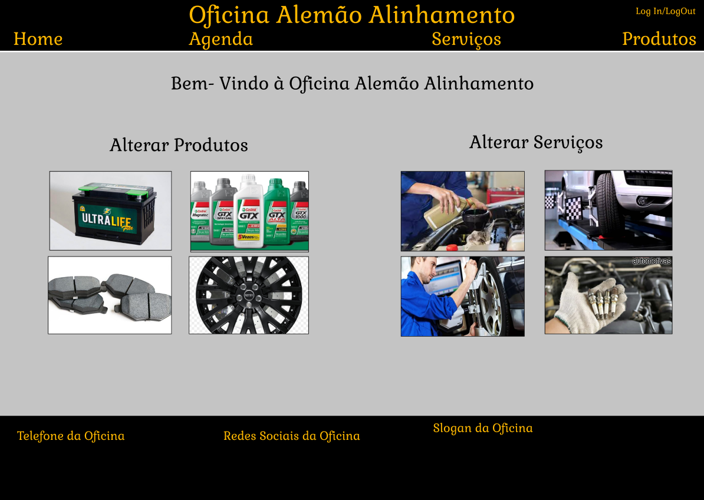

# Interface de usuário NUM - NOME DA INTERFACE

## 1. Leiaute sugerido

## 2. Relacionamentos com outras interfaces
A interface "Home", será o ponto inicial do site, ou seja, a primeira interface acessada pelo usuário será ela, e será nela que após o cadastro do usuário será enviado.
Esta interface permite através do header, uma navegação com as outras páginas, apenas ao clicar na indicação.

## 3. Comandos

| **Número** | **Nome** | **Ação** | **Restrições** |
| --- | --- | --- | --- |
|1. | Home | Uma indicação presente no header que quando clicada leva até a página inicial do site da oficina | --não possui-- |
|2. | Quem Somos | Uma indicação no header que quando clicada leva até a página de informações da oficina | --não possui-- |
|3. | Serviços | Uma indicação no header que quando clicada leva até a página de serviços oferecidos pela oficina | --não possui-- |
|4. | Produtos | Uma indicação na parte superior que quando clicada leva até a página de produtos a venda da oficina | --não possui-- |
|5. | Log In/Log Out | Uma indicação na parte superior que quando clicada leva até a página de Log In ou quando já logado o usuário pode fazer o Log Out da sua conta | --não possui-- |
|6.| Alterar Produtos| Ao selecionar esta opção, é possivel editar a pagina de produtos, retirando-os|--não possui--|
|7.| Alterar Serviços|Ao selecionar esta opção, é possivel editar a pagina de Serviços, retirando-os|--não possui--|
