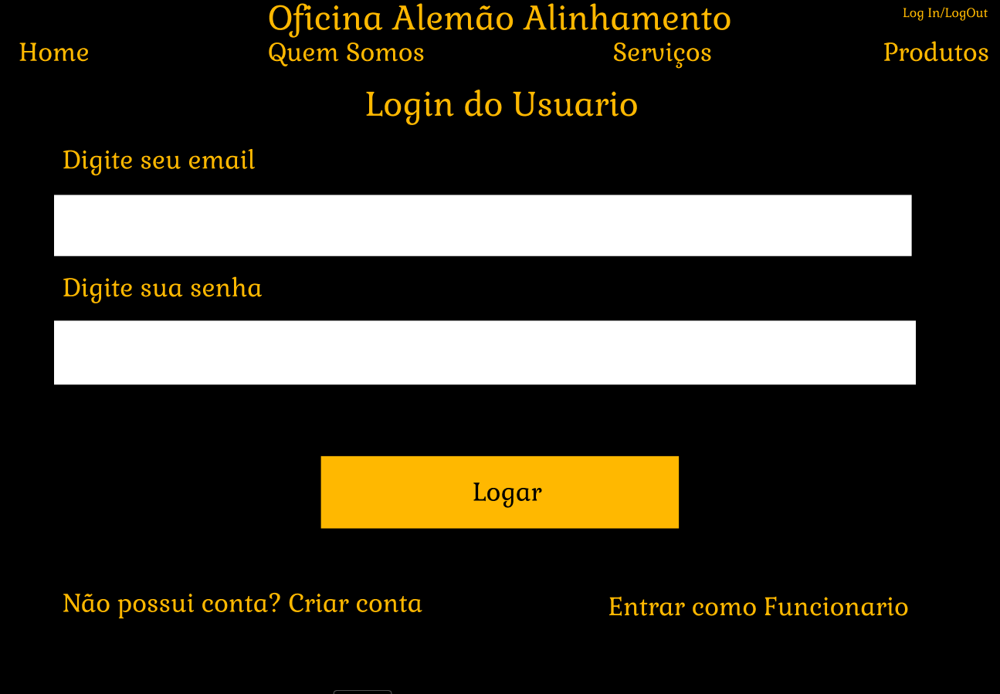

# Interface de usuário 3 - Log In

## 1. Leiaute sugerido

## 2. Relacionamentos com outras interfaces

Esta interface permite através do header, uma navegação com as outras páginas, apenas ao clicar na indicação.
Também há uma opção para criar conta que levará o usuário ao campo de cadastro.

## 3. Campos

| **Número** | **Nome** | **Descrição** | **Valores válidos** | **Formato** | **Tipo** | **Restrições** |
| --- | --- | --- | --- | --- | --- | --- |
|1. |Preencher Email|Um campo onde o usuário deve preencher com seu email para efetuar o login|Todos|Texto|String|Necessario inserir ao menos o"@" e o ".com"|
|2. |Preencher Senha| Espaço para que deve ser preenchido pela senha referente a conta do email inserido anteriormente | Deve possuir ao menos uma letra maiúscula e um número | Texto | String | -não possui-- |

## 4. Comandos

| **Número** | **Nome** | **Ação** | **Restrições** |
| --- | --- | --- | --- |
|1. | Home | Uma indicação presente no header que quando clicada leva até a página inicial do site da oficina | --não possui-- |
|2. | Quem Somos | Uma indicação no header que quando clicada leva até a página de informações da oficina | --não possui-- |
|3. | Serviços | Uma indicação no header que quando clicada leva até a página de serviços oferecidos pela oficina | --não possui-- |
|4. | Produtos | Uma indicação na parte superior que quando clicada leva até a página de produtos a venda da oficina | --não possui-- |
|5. | Log In/Log Out | Uma indicação na parte superior que quando clicada leva até a página de Log In ou quando já logado o usuário pode fazer o Log Out da sua conta | --não possui-- |
|6. | Logar | Analisa os conteúdos preenchidos no "Inserir Senha" e no "Inserir Email" verificando se são verdadeiros, e realiza e efetua a ação de entrar na conta do usuário | --não possui-- |
|7. | Criar Conta | Se o usuário ainda não possuir uma conta no site, é possível criá-la entrando na página por meio do hiperlink | --não possui-- |

