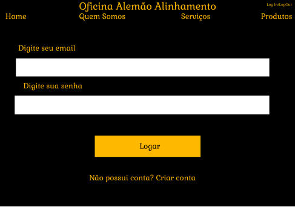

# Interface de usuário NUM - NOME DA INTERFACE

## 1. Leiaute sugerido

## 2. Relacionamentos com outras interfaces

Esta interface permite atravez do header, uma navegação com as outras paginas, apenas ao clicar na indicação.
Também há uma opção para criar conta que levará o usuario ao campo de cadastro.

## 3. Campos

| **Número** | **Nome** | **Descrição** | **Valores válidos** | **Formato** | **Tipo** | **Restrições** |
| --- | --- | --- | --- | --- | --- | --- |
|1. | Home | Uma indicação presente no header que quando clicada leva até a pagina inicial do site da oficina | Click | Hiperlink | Onclick | --não possui-- |
|2. | Quem Somos | Uma indicação no header que quando clicada leva ate a pagina de informações da oficina | Click | Hiperlink | Onclick | --não possui-- |
|3. | Serviços | Uma indicação no header que quando clicada leva ate a pagina de serviços oferecidos pela oficina | Click | Hiperlink | Onclick | --não possui-- |
|4. | Produtos | Uma indicação na parte superior que quando clicada leva ate a pagina de produtos a venda da oficina | Click | Hiperlink | Onclick | --não possui-- |
|4. | Log In/Log Out | Uma indicação na parte superior que quando clicada leva ate a pagina de Log In ou quando ja logado o usuario pode fazer o Log Out da sua conta | Click | Hiperlink | Onclick | --não possui-- |
|5. |Inserir Email|Um campo onde o usuario deve preencher com seu email para efetuar o login|Todos|Texto|String|--não possui--|
|6. |Inserir Senha| Espaço para que deve ser preenchido pela senha referente a conta do email inserido anteriormente | Deve possuir ao menos uma letra maiuscula e um numero | Texto | String | -não possui-- |
|7. | Criar Conta | Se o usuario ainda não possuir uma conta no site, é possiver cria-la entrando na pagina atravez do hiperlink | Click | Hiperlink | Onclick | --não possui-- |

## 4. Comandos

| **Número** | **Nome** | **Ação** | **Restrições** |
| --- | --- | --- | --- |
|1. | Logar | Analisa os conteudos preenchidos no "Inserir Senha" e no "Inserir Email" verificando se são verdadeiros, e realiza e efetua a ação de entrar na conta do usuario | --não possui-- |

