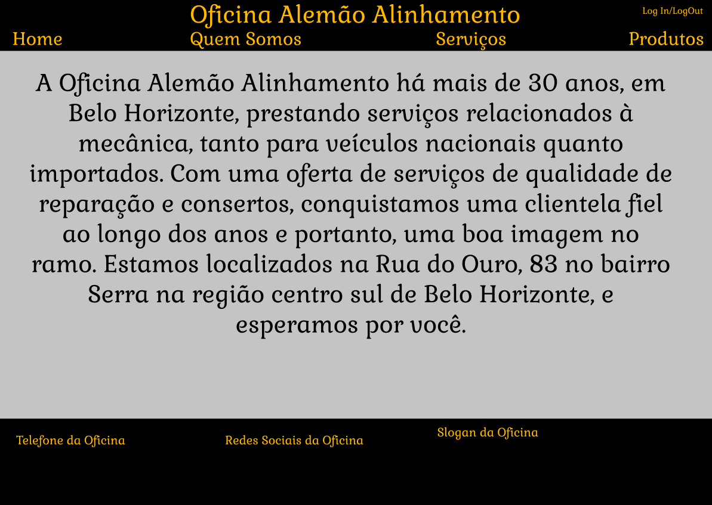

# Interface de usuário NUM - Quem Somos

## 1. Leiaute sugerido

## 2. Relacionamentos com outras interfaces

Esta interface permite atravez do header, uma navegação com as outras paginas, apenas ao clicar na indicação.

## 4. Comandos

| **Número* | **Nome** | **Ação** | **Restrições** |
| --- | --- | --- | --- |
|1. | Home | Uma indicação presente no header que quando clicada leva até a página inicial do site da oficina | --não possui-- |
|2. | Quem Somos | Uma indicação no header que quando clicada leva até a página de informações da oficina | --não possui-- |
|3. | Serviços | Uma indicação no header que quando clicada leva até a página de serviços oferecidos pela oficina | --não possui-- |
|4. | Produtos | Uma indicação na parte superior que quando clicada leva até a página de produtos a venda da oficina | --não possui-- |
|5. | Log In/Log Out | Uma indicação na parte superior que quando clicada leva ate a página de Log In ou quando ja logado o usuário pode fazer o Log Out da sua conta | --não possui-- |

