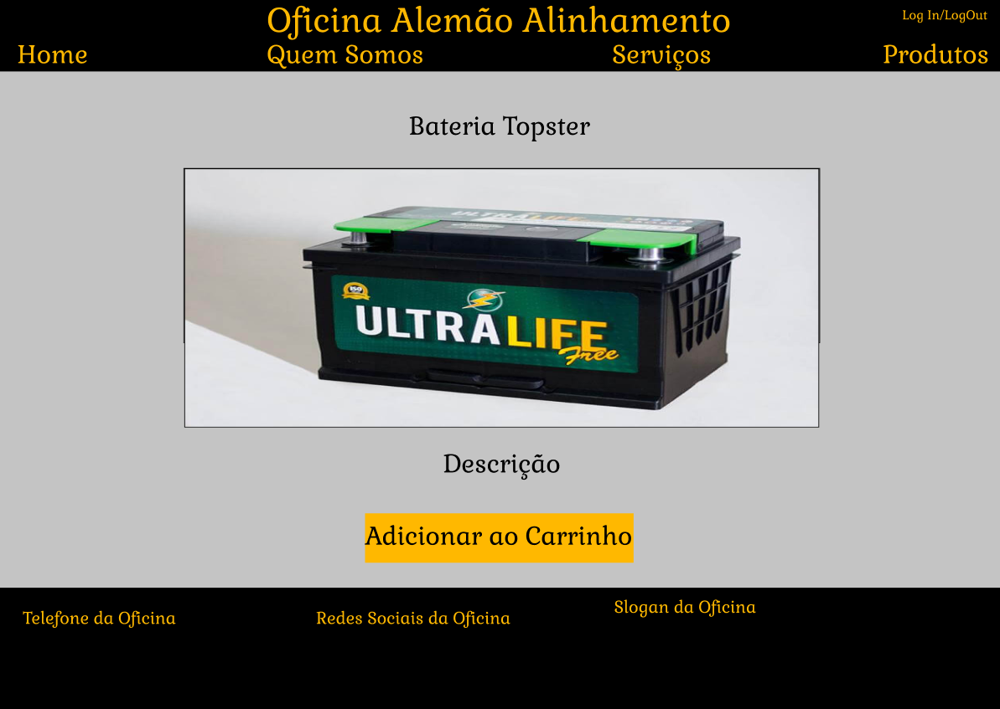

# Interface de usuário 7 - Produtos

## 1. Leiaute sugerido

## 2. Relacionamentos com outras interfaces

Esta interface permite através do header, uma navegação com as outras páginas, apenas ao clicar na indicação.

## 3. Comandos

| **Número** | **Nome** | **Ação** | **Restrições** |
| --- | --- | --- | --- |
|1. | Efetuar Compra | Um botão que validará a disponibilidade do produto e permitirá a efetuação ou não da compra | Falta de dinheiro ou do produto em estoque |
|2. | Home | Uma indicação presente no header que quando clicada leva até a página inicial do site da oficina | --não possui-- |
|3. | Quem Somos | Uma indicação no header que quando clicada leva até a página de informações da oficina | --não possui-- |
|4. | Serviços | Uma indicação no header que quando clicada leva até a página de serviços oferecidos pela oficina | --não possui-- |
|5. | Produtos | Uma indicação na parte superior que quando clicada leva até a página de produtos a venda da oficina | --não possui-- |
|6. | Log In/Log Out | Uma indicação na parte superior que quando clicada leva até a página de Log In ou quando já logado o usuário pode fazer o Log Out da sua conta | --não possui-- |

