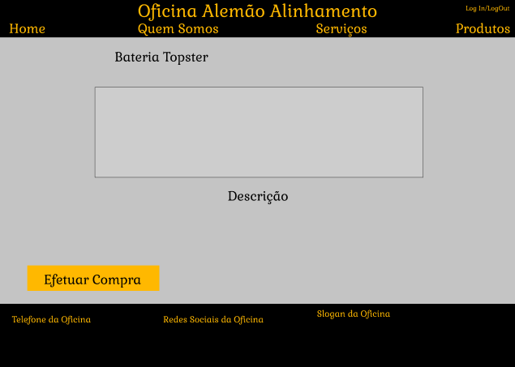

# Interface de usuário NUM - NOME DA INTERFACE

## 1. Leiaute sugerido

## 2. Relacionamentos com outras interfaces

## 3. Campos

| **Número** | **Nome** | **Descrição** | **Valores válidos** | **Formato** | **Tipo** | **Restrições** |
| --- | --- | --- | --- | --- | --- | --- |
|1. | Home | Uma indicação presente no header que quando clicada leva até a pagina inicial do site da oficina | Click | Hiperlink | Onclick | --não possui-- |
|2. | Quem Somos | Uma indicação no header que quando clicada leva ate a pagina de informações da oficina | Click | Hiperlink | Onclick | --não possui-- |
|3. | Serviços | Uma indicação no header que quando clicada leva ate a pagina de serviços oferecidos pela oficina | Click | Hiperlink | Onclick | --não possui-- |
|4. | Produtos | Uma indicação na parte superior que quando clicada leva ate a pagina de produtos a venda da oficina | Click | Hiperlink | Onclick | --não possui-- |
|5. | Log In/Log Out | Uma indicação na parte superior que quando clicada leva ate a pagina de Log In ou quando ja logado o usuario pode fazer o Log Out da sua conta | Click | Hiperlink | Onclick | --não possui-- |

## 4. Comandos

| **Número** | **Nome** | **Ação** | **Restrições** |
| --- | --- | --- | --- |
|1. | Efetuar Compra | Um botão que validará a disponibilidade do produto e permitirá a efetuação ou não da compra | Falta de dinheiro ou do produto em estoque |

