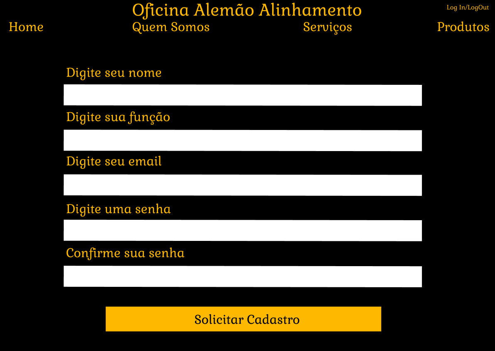

# Interface de usuário NUM - Cadastro Funcionario

## 1. Leiaute sugerido

## 2. Relacionamentos com outras interfaces
Esta interface permite através do header, uma navegação com as outras páginas, apenas ao clicar na indicação.
## 3. Campos

| **Número** | **Nome** | **Descrição** | **Valores válidos** | **Formato** | **Tipo** | **Restrições** |
| --- | --- | --- | --- | --- | --- | --- |
|1. |Digite seu Nome | O funcionario irá inserir seu Nome neste campo | Somente Letras | Texto | String | Numeros |
|2. | Digite sua Função | O funcionario ira inserir em que parte da Ofcina ele atua | Somente Letras | Texto | String | Numeros |
|3. | Digite seu email| O funcionario, neste campo, preenchera seu email|TODOS |Texto | String |--não possui-- |
|4. |Digite uma senha | O funcionario preenchera com sua senha desejada | TODOS |Texto  | String |--não possui |
|5. |Confirme sua senha | Neste campo o funcionario preenchera sua senha ja inserida no campo anterior   | TODOS | Texto | String | Deve ser exatamente igual ao campo acima |

## 4. Comandos

| **Número** | **Nome** | **Ação** | **Restrições** |
| --- | --- | --- | --- |
|1. | Home | Uma indicação presente no header que quando clicada leva até a página inicial do site da oficina | --não possui-- |
|2. | Quem Somos | Uma indicação no header que quando clicada leva até a página de informações da oficina | --não possui-- |
|3. | Serviços | Uma indicação no header que quando clicada leva até a página de serviços oferecidos pela oficina | --não possui-- |
|4. | Produtos | Uma indicação na parte superior que quando clicada leva até a página de produtos a venda da oficina | --não possui-- |
|5. | Log In/Log Out | Uma indicação na parte superior que quando clicada leva até a página de Log In ou quando já logado o usuário pode fazer o Log Out da sua conta | --não possui-- |
|6.| Solicitar Cadastro| Neste botão o usuario enviará um email com a solicitação á um outro funcionario da Oficina para aceita-lo como funcionario também|--não possui|
