# OFICINA ALEMÃO ALINHAMENTO 

**Bruno Silveira Cerqueira Lima, brunobhsclima@gmail.com**

**Gabriel Oliveira Gomide, gogomide.go@gmail.com**

**Mateus Samartini de Toledo, mateusamartini@gmail.com**

---

_Curso de Engenharia de Software, Unidade Praça da Liberdade_

_Instituto de Informática e Ciências Exatas – Pontifícia Universidade Católica de Minas Gerais (PUC MINAS), Belo Horizonte – MG – Brasil_

---

_**Resumo**. O site Oficina Alemão Alinhamento foi projetado e desenvolvido por 3 desenvolvedores afim de entregar uma plataforma com interfaces funcionais que sirvam de auxílio dos processos internos realizadas na oficina. O objetivo principal da realização desse trabalho é conseguir entregar ao dono da oficina, um site que atenda às suas necessidades de manutenção do estoque de produtos e da disponibilidade de serviços, além da organização e expansão das vendas de sua microempresa. Com isso, o sistema terá um processo de vendas mais dinâmico e pontual evitando a ambiguidade de informações sobre os horários, produtos e serviços presentes, possibilitando uma rápida navegação e um acesso às funcionalidades mais efetivo tanto para os funcionários da empresa quanto para os clientes.  _

---

## 1. Introdução

    1.1 Contextualização
O trabalho em questão refere-se ao processo de desenvolvimento de um sistema que atenda às necessidades de um cliente real, nesse caso, a Oficina Alemão Alinhamento.
Com isso, o trabalho visa ao desenvolvimento de um sistema web que garanta que as necessidades da Alemão Alinhamento, tanto na gestão de processos internos, quanto no ganho competitivo com processos de venda e agendamento de serviços online, sejam devidamente atendidos.
  Tendo em vista o melhor desempenho e eficiência no desenvolvimento da plataforma foi adotada a metodologia ágil de desenvolvimento baseada no scrum, de modo que as tarefas foram divididas entre os membros do grupo usando o projects do github como suporte para gestão das tarefas e,também, eram feitas constantes e curtas reuniões entre os membros para discutir e refletir sobre as implementações, os artefatos e seus resultados. Além disso, ao final de cada ciclo de sprint foi entregue ao menos uma  nova funcionalidade de valor do sistema que foi validada junto ao cliente à conforme o seu desenvolvimento.

    1.2 Problema

   A Oficina Alemão Alinhamento encontra-se estagnada no tempo, pois não possui algum tipo de sistema que propicie a divulgação e a execução de seus serviços na internet.Com isso, o crescimento da empresa está prejudicado pela sua exclusão no mundo digital em detrimento a sua concorrência que ,cada vez mais, busca por se modernizar e se informatizar,de modo que essas tem conseguido fomentar sua competitivade e adaptar seus modelos de negócios ao mundo atual em função do uso de novas tecnologias e do desenvolvimento de suas próprias plataformas online.

    1.3 Objetivo geral

   Este projeto visa ao desenvolvimento de um sistema web que propicie que a Oficina Alemão Alinahmento possa realizar seus processos de venda e de agendamento de serviços de forma prática online.

        1.3.1 Objetivos específicos

1.  Divulgar o negócio da Alemão Alinhamento por meio deste sistema.
2.  Auxiliar na organização de processos internos da oficina.
3.  Fomentar as vendas e as prestações de serviços.

        1.4 Justificativas

Diante da problemática apresentada sobre exclusão digital da Alemão Alinhamento, o sistema desenvolvido propiciará que essa ganhe relevância digital e dinamize seus processos, tanto de venda de produtos e prestação de serviços, quanto para processos de gestão interna, assim, este favorecerá que essa consiga fomentar sua competitividade e expandir seu mercado consumidor.

## 2. Stakeholders

As partes interessadas no projeto se subdividem em dois grupos distintos, os usuários clientes que usam a plataforma desenvolvida visando à obter soluções práticas, por preços justos para suas demandas por serviços ou produtos automobilísticos em uma plataforma segura e fácil de se usar. E os usuários da Alemão Alinhamento, que são o próprio dono da oficina que deseja por meio do sistema desenvolvidos conseguir visibilidade digital, ganho de mercado consumidor e dinamizar e modernizar seus processos internos como controle de seu estoque, de sua agenda e das ações de seus funcionários. Além disso, os outros usuários da Alemão Alinhamento são os prórpios funcionários da ofinica que almejam que com o sistema estes consigam se organizar melhor e ganhar tempo, logo, produtividade, nas ações cotidianas e trabalhosas que estes tem no seu dia-a-dia, como atualizar e conferir um estoque ou consultar os horários agendados em uma data específica.

## 3. Proposta da solução

Diante da problemática apresentada pelo projeto, este projeto visa ao desenvolvimento de um sistema web que propicie que a Alemão Alinhamento possa realizar seus processos de venda e de agendamento de serviços de forma prática online e também divulgar seu negócio por meio deste.
Há outros fatores que o sistema não prevê a disponibilidade em plataformas mobile como também não é previsto que a plataforma armazene ou agende datas previstas para a próxima revisão ou retorno do carro de um cliente que já tenha agendado esse tipo de serviço no site uma vez, outro fator importante é o fato de que todos os pagamentos devem se realizados na loja física e os produtos não possuem delivery.
   Os requisitos funcionais do site são:
* Deve ser possível que o cliente consiga se cadastrar no sistema como cliente ao entrar neste.
* Deve ser possível que os funcionários da empresa consigam se cadastrar no sistema como funcionários/proprietários.
* Deve ser possível que o usuário funcionário consiga realizar a postagem dos itens produto no estoque do sistema. 	
* Deve ser possível que o usuário funcionário consiga adicionar quantidades de um produto já cadastrado no sistema. 
*  Deve ser possível que o usuário funcionário consiga consultar a quantidade de um produto no sistema. 
* Deve ser possível que o usuário funcionário consiga realizar a postagem dos anúncios dos produtos e das informações destes no site.
* Uma vez cadastrados os produtos e suas informações devem ser visíveis para todos os usuários do site (autenticados ou não).

## 4. Projeto da Solução

O site Alemão Alinhamento criado a partir dos requerimentos do dono da oficina, provém utilizar um sistema que almeja facilitar o processo dos clientes e dos funcionários da loja, principalmente no meio digital.
O site, composto de um banco de dados MySQL com 7 tabelas conectadas por chaves estrangeiras, procuramos utilizar PHP integrado com HTML, para que seja possível as interações no front-end e no back-end, junto com HTML, foi inserido códigos da linguagem CSS, com o intuito de estilizar o site e deixa-lo mais apresentável possível, além destas linguagens adicionamos vagamente códigos da linguagem JavaScript para conectar os últimos detalhes.

## 5. Artefatos principais

Devem ser apresentados os artefatos criados para a solução do problema 
(ex. software, protótipos, especificações de requisitos, modelagem de processos, 
documentos arquiteturais, etc). Os artefatos não devem ser apresentados na íntegra, 
mas o texto deve apresentar o que foi feito como solução para o problema apresentado.

* Interfaces 
    * Cadastrar Cliente: Utiliza os dados inseridos nos espaços para montar um perfil do qual representa o Cliente
      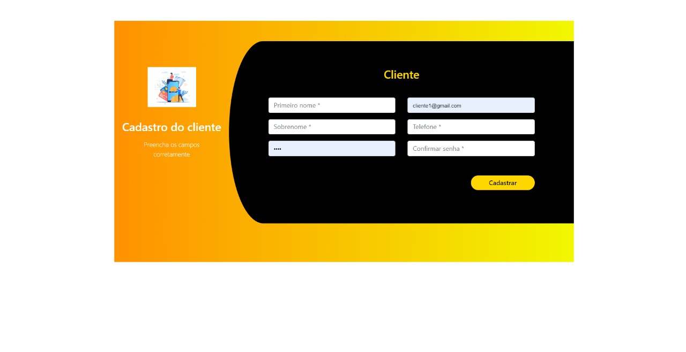
    * Cadastrar Funcionario: Utiliza os dados inseridos nos espaços para montar um perfil do qual representa o Funcionario
      
    * Cadastrar Produto: Utiliza os dados inseridos nos espaços para formatar um item que representa o Produto
      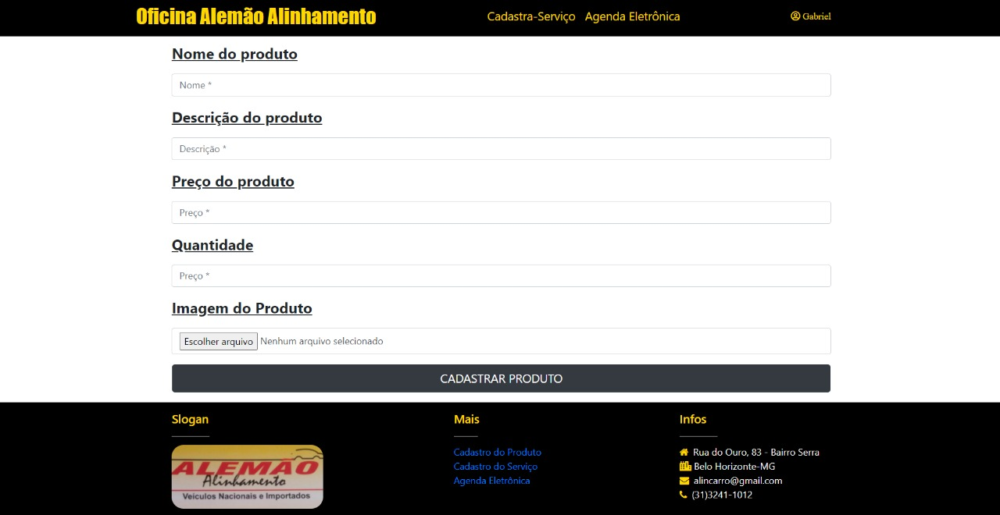
    * Cadastrar Serviço: Utiliza os dados inseridos nos espaços para formatar um item que representa o Produto
      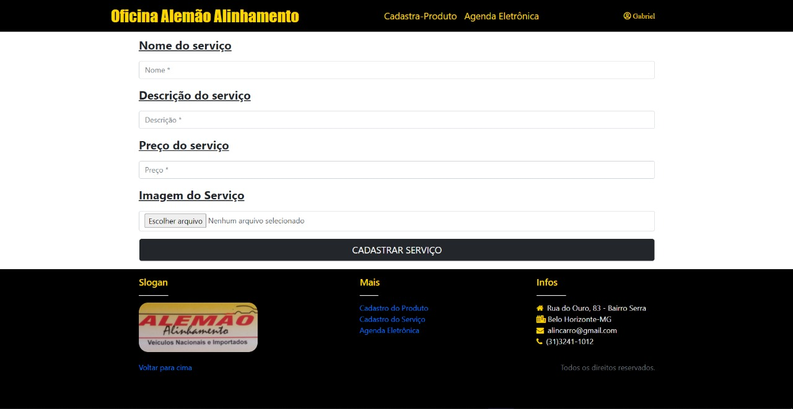
    * Login Cliente: Espaço no qual o Cliente deve utilizar seus dados para poder acessar sua Conta
      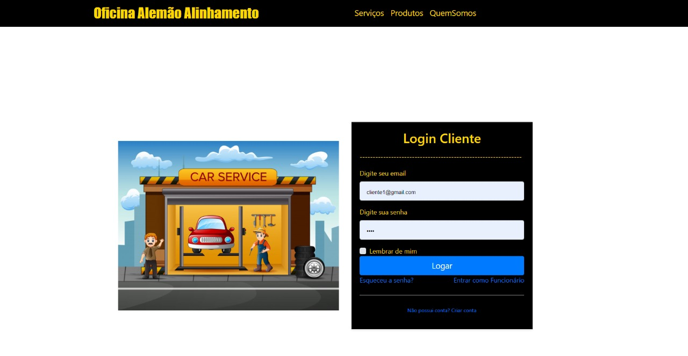
    * Login Funcionario: Espaço no qual o Funcionario deve utilizar seus dados para poder acessar sua Conta
      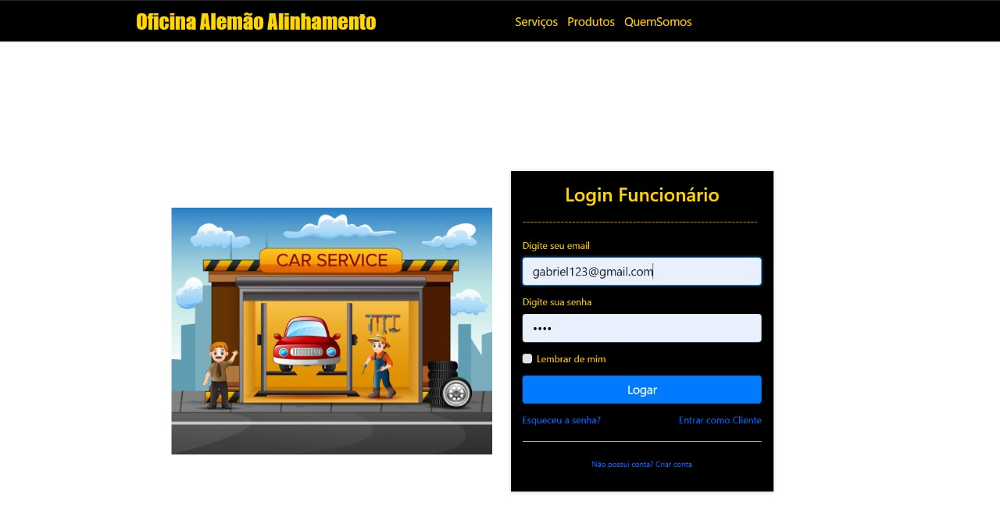
    * Quem Somos: Pagina designada a informar ao Cliente sobre a loja e suas informações
      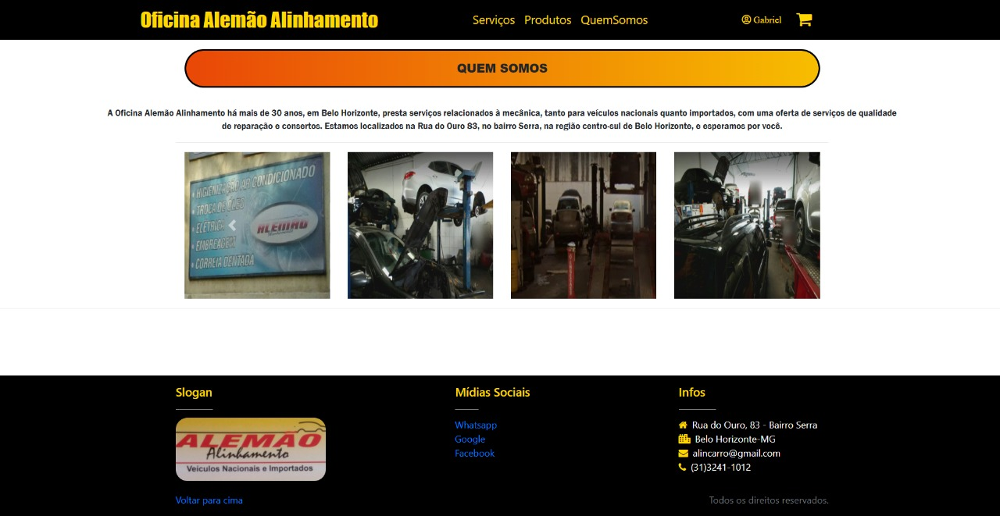
    * Visualizar Agendamentos de Serviço na Agenda Eletronica: Espaço para informar ao Funcionarios as informações do Serviço no dia Selecionado
      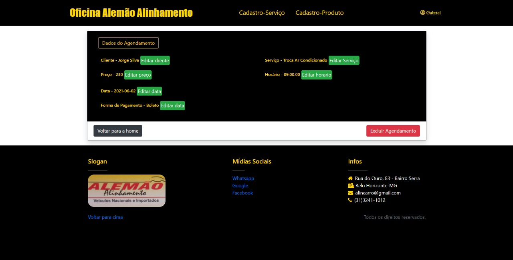
    * Visualizar Carrinho: Pagina dedicada a mostrar ao Cliente o que ele selecionou para realizar o pedido
      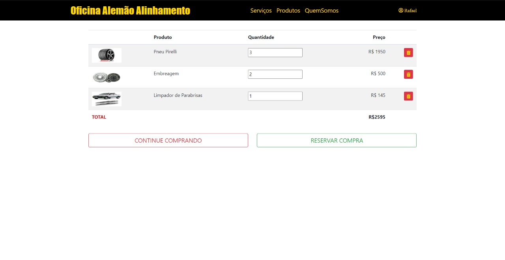
    * Manter Perfil Cliente: Pagina destinada ao Cliente para poder visualizar e alterar suas proprias informações
      
    * Manter Perfil Funcionario: Pagina destinada ao Funcionario para poder visualizar e alterar suas proprias informações
      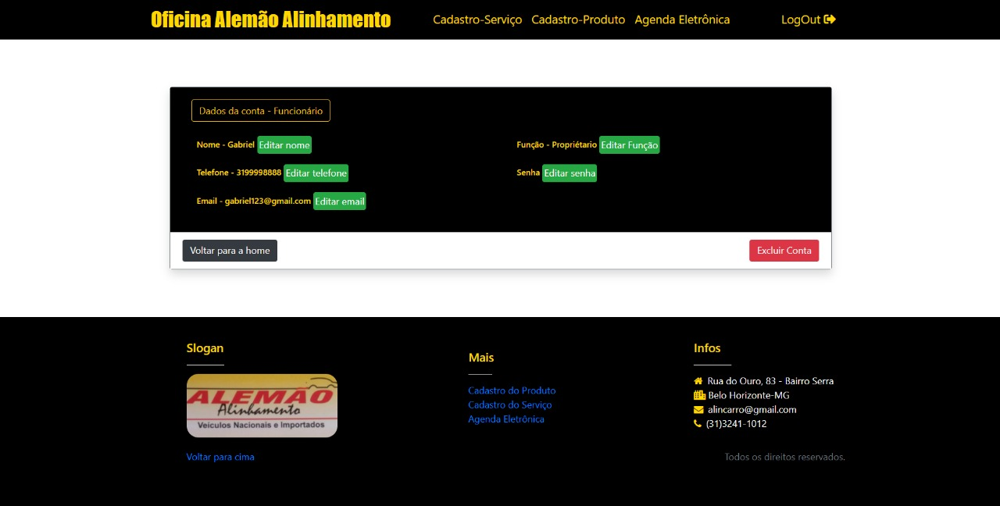
    * Visualizar Produto Cliente: Paginas dedicadas ao Cliente que tem como objetivo mostrar ampliar as informações disoniveis sobre um certo produto
      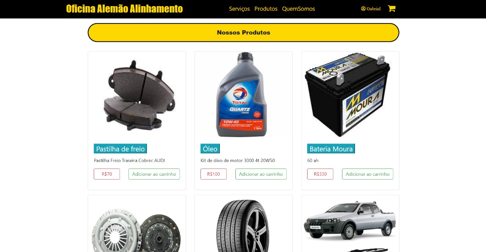
      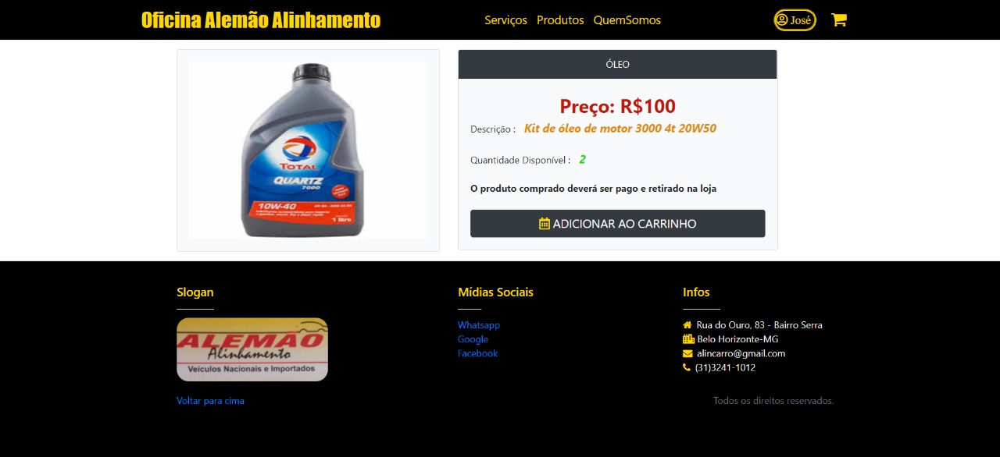
    * Visualizar Produto Funcionario: Paginas dedicadas ao Funcionario que o permite acessar, visualizar e editar todos os produtos disponiveis no site
      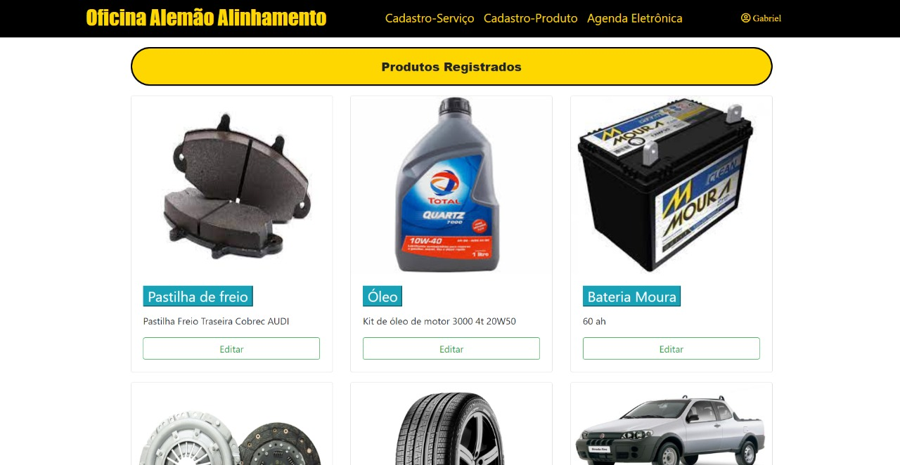
      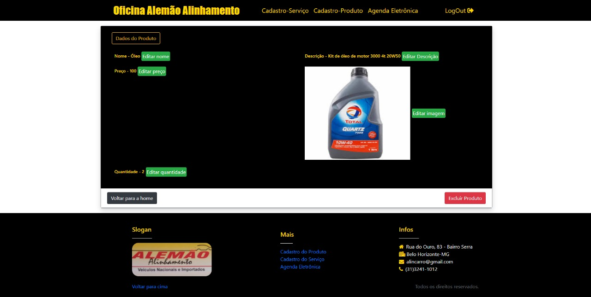
    * Visualizar Produtos Agenda Eletronica: Espaço para informar ao Funcionario quais Produtos estão marcados para o dia selecionado
      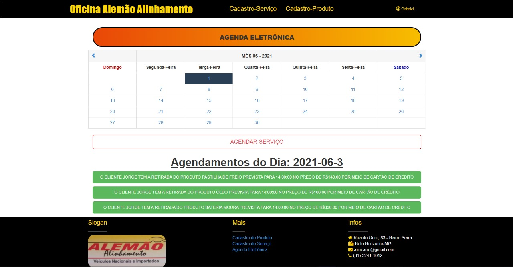
    * Visualizar Serviço Cliente: Paginas dedicadas ao Cliente que tem como objetivos mostrar e ampliar as informações disoniveis sobre um certo produto
      
      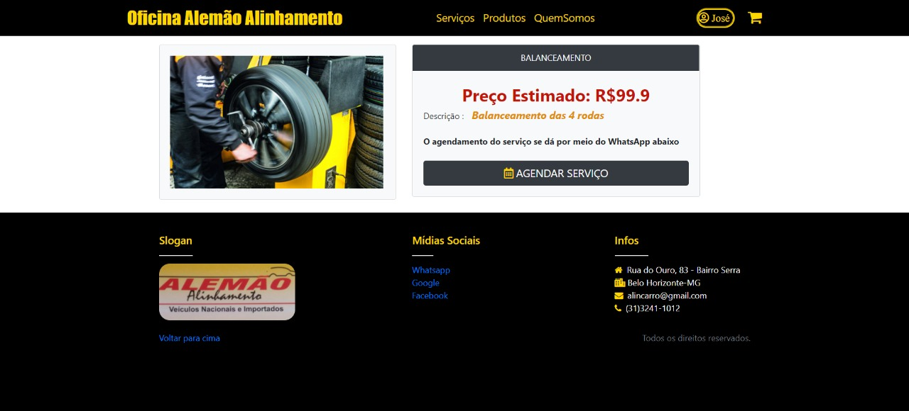
    * Visualizar Serviço Funcionario: Pagina dedicada ao FUncionario para que ele possa visualizar e acessar todos os Serviços disponiveis no site
      
    * Visualizar Serviços na Agenda Eletronica: Espaço para informar ao Funcionario quais Serviços estão marcados para o dia selecionado
      

## 6. Conclusão

Devem ser apresentadas as conclusões do trabalho, resgatando os objetivos e 
apresentando os principais resultados, contribuições e lições aprendidas.

# APÊNDICES

**Colocar link:**

Do repositório no github: < https://github.com/ICEI-PUC-Minas-PPLES-TI/plf-es-2021-1-ti3-6653100-gabriel-bruno-mateus >

Do vídeo de apresentação.

