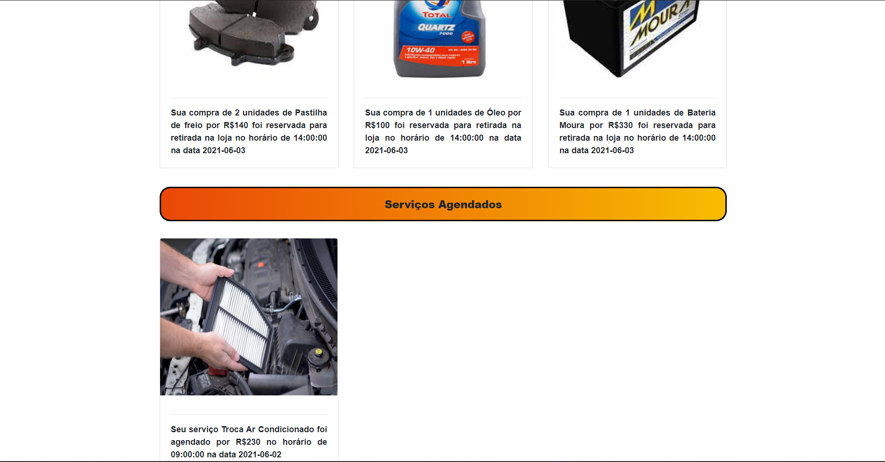
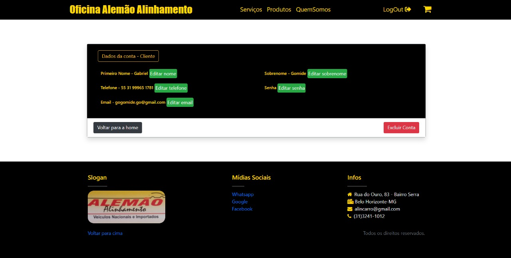

# OFICINA ALEMÃO ALINHAMENTO 

**Bruno Silveira Cerqueira Lima, brunobhsclima@gmail.com**

**Gabriel Oliveira Gomide, gogomide.go@gmail.com**

**Mateus Samartini de Toledo, mateusamartini@gmail.com**

---

_Curso de Engenharia de Software, Unidade Praça da Liberdade_

_Instituto de Informática e Ciências Exatas – Pontifícia Universidade Católica de Minas Gerais (PUC MINAS), Belo Horizonte – MG – Brasil_

---

_**Resumo**. O site Oficina Alemão Alinhamento foi projetado e desenvolvido por 3 desenvolvedores afim de entregar uma plataforma com interfaces funcionais que sirvam de auxílio dos processos internos realizadas na oficina. O objetivo principal da realização desse trabalho é conseguir entregar ao dono da oficina, um site que atenda às suas necessidades de manutenção do estoque de produtos e da disponibilidade de serviços, além da organização e expansão das vendas de sua microempresa. Com isso, o sistema terá um processo de vendas mais dinâmico e pontual evitando a ambiguidade de informações sobre os horários, produtos e serviços presentes, possibilitando uma rápida navegação e um acesso às funcionalidades mais efetivo tanto para os funcionários da empresa quanto para os clientes.  _

---

## 1. Introdução

    1.1 Contextualização
O trabalho em questão refere-se ao processo de desenvolvimento de um sistema que atenda às necessidades de um cliente real, nesse caso, a Oficina Alemão Alinhamento.
Com isso, o trabalho visa ao desenvolvimento de um sistema web que garanta que as necessidades da Alemão Alinhamento, tanto na gestão de processos internos, quanto no ganho competitivo com processos de venda e agendamento de serviços online, sejam devidamente atendidos.  Tendo em vista o melhor desempenho e eficiência no desenvolvimento da plataforma foi adotada a metodologia ágil de desenvolvimento baseada no scrum, de modo que as tarefas foram divididas entre os membros do grupo usando o projects do github como suporte para gestão das tarefas e,também, eram feitas constantes e curtas reuniões entre os membros para discutir e refletir sobre as implementações, os artefatos e seus resultados. Além disso, ao final de cada ciclo de sprint foi entregue ao menos uma  nova funcionalidade de valor do sistema que foi validada junto ao cliente à conforme o seu desenvolvimento.

    1.2 Problema

   A Oficina Alemão Alinhamento encontra-se estagnada no tempo, pois não possui algum tipo de sistema que propicie a divulgação e a execução de seus serviços na internet.Com isso, o crescimento da empresa está prejudicado pela sua exclusão no mundo digital em detrimento a sua concorrência que ,cada vez mais, busca por se modernizar e se informatizar,de modo que essas tem conseguido fomentar sua competitivade e adaptar seus modelos de negócios ao mundo atual em função do uso de novas tecnologias e do desenvolvimento de suas próprias plataformas online.

    1.3 Objetivo geral

   Este projeto visa ao desenvolvimento de um sistema web que propicie que a Oficina Alemão Alinahmento possa realizar seus processos de venda e de agendamento de serviços de forma prática online.

        1.3.1 Objetivos específicos

   1.  Divulgar o negócio da Alemão Alinhamento por meio deste sistema.
   2.  Auxiliar na organização de processos internos da oficina.
   3.  Fomentar as vendas e as prestações de serviços.

    1.4 Justificativas

Diante da problemática apresentada sobre exclusão digital da Alemão Alinhamento, o sistema desenvolvido propiciará que essa ganhe relevância digital e dinamize seus processos, tanto de venda de produtos e prestação de serviços, quanto para processos de gestão interna, assim, este favorecerá que essa consiga fomentar sua competitividade e expandir seu mercado consumidor.

## 2. Stakeholders

As partes interessadas no projeto se subdividem em dois grupos distintos, os usuários clientes que usam a plataforma desenvolvida visando à obter soluções práticas, por preços justos para suas demandas por serviços ou produtos automobilísticos em uma plataforma segura e fácil de se usar. E os usuários da Alemão Alinhamento, que são o próprio dono da oficina que deseja por meio do sistema desenvolvidos conseguir visibilidade digital, ganho de mercado consumidor e dinamizar e modernizar seus processos internos como controle de seu estoque, de sua agenda e das ações de seus funcionários.  Além disso, os outros usuários da Alemão Alinhamento são os prórpios funcionários da ofinica que almejam que com o sistema estes consigam se organizar melhor e ganhar tempo, logo, produtividade, nas ações cotidianas e trabalhosas que estes tem no seu dia-a-dia, como atualizar e conferir um estoque ou consultar os horários agendados em uma data específica.

## 3. Proposta da solução

Diante do atual cenário de praticidade e diminuição de custos proporcionada pelo e-commerce, o mercado se atualizou bastante e portanto, este trabalho visa e objetiva a criação de um sistema web atualizado e moderno que possa providenciar à Alemão Alinhamento um espaço para realizar seus trabalhos de venda de produtos e de agendamento de serviços de uma forma prática online e também divulgar seu negócio por meio deste. Por isso, o projeto visa a construção de um ambiente virtual que apresente os recursos e funcionalidades suficientes que auxiliem e atendam a demanda do sistema comercial adotado pela oficina.

* Os Requisitos Funcionais do site são:

      1) Deve ser possível que o cliente consiga se cadastrar no sistema como cliente ao entrar neste. 

      2) Deve ser possível que os funcionários da empresa consigam se cadastrar no sistema como funcionários/proprietários. 
     
      3) Deve ser possível que o usuário funcionário consiga realizar a postagem dos itens produto no estoque do sistema. 	 

      4) Deve ser possível que o usuário funcionário consiga adicionar quantidades de um produto já cadastrado no sistema.  

      5) Deve ser possível que o usuário funcionário consiga consultar a quantidade de um produto no sistema.  

      6) Deve ser possível que o usuário funcionário consiga realizar a postagem dos anúncios dos produtos e das informações destes no site. 

      7) Uma vez cadastrados os produtos e suas informações devem ser visíveis para todos os usuários do site (autenticados ou não). 

      8) Os usuários clientes devem conseguir armazenar os itens escolhidos na página "carrinho de compra".
      
      9) Os usuários clientes devem conseguir realizar a compra dos produtos anunciados na plataforma.	
      
      10) Deve ser possível que o usuário funcionário consiga realizar a postagem dos serviços ofertados pela oficina no site.	
      
      11) Uma vez cadastrados, os serviços e suas informações devem ser visíveis para todos os usuários do site (autenticados ou não).	

      12) Os usuários cliente ao clicarem para agendar o serviço devem ser reedirecionados diretamente para o WhatsApp da Alemão Alinahmento para contactar sua equipe.	
      
      13) Os usuários funcionário devem ser capazes de gerir a disponibilidade das ofertas de serviço no site.	
      
      14) Os usuários funcionário devem conseguir cadastrar agendamentos de serviço na agenda eletrônica da plataforma.	
      
      15) Os usuário funcionário devem ser capazes de realizarem consultas na agenda eletrônica.	
      
      16) Deve haver no sistema uma forma dos clientes entrarem em contato diretamente com a equipe da Alemão Alinhamento por meio do WhatsApp ou email.    

* Os Requisitos Não Funcionais do site são:

      | ID | Descrição do Requisito | Prioridade | Complexidade |
      | --- | --- | --- | --- |
      | 1 | O sistema deve estar na disponível na internet por 24h todos os dias da semana | alta | média |
      | 2 | O sistema deve ser fácil de se utilizar para diversos tipos e perfis de usuários, fazendo que o usuário consiga se cadastrar e finalizar um processo de compra em menos de 10 clicks| alta | baixa |
      | 3 | O sistema deve entregar respostas em até 30 segundos às requisições dos usuários | média | média |
      | 4 | O sistema deve suportar até 100 requisições simultanêas | baixa | média |
      | 5 | O sistema deve armazenar o nome do cliente em dois campos distintos( nome e sobrenome) | baixa | baixa |

## 4. Projeto da Solução

O site Alemão Alinhamento criado a partir dos requerimentos do dono da oficina, provém utilizar um sistema que almeja facilitar o processo dos clientes e dos funcionários da loja, principalmente no meio digital.
O site, composto de um banco de dados MySQL com 7 tabelas conectadas por chaves estrangeiras, utiliza o PHP integrado com HTML, para que seja possível as interações no front-end e no back-end, junto com HTML, sendo inseridos, também, códigos da linguagem CSS, com o intuito de estilizar o site e deixá-lo mais apresentável possível. Além das linguagens já citadas, foi utilizado vagamente códigos da linguagem JavaScript para complementar detalhes adicionais ao sistema.

## 5. Artefatos principais

Durante o desenvolvimento do site, foram elaborados e utilizados como suporte para a criação das interfaces, os seguintes artefatos: 

* DIAGRAMA DE CASOS DE USO  
    * Será mostrado a seguir o diagrama de casos de uso criado para externar as funcionalidades presentes no sistema e como elas se relacionam entre os atores( usuários do sistema).
   

* PROTÓTIPOS DAS PRINCIPAIS INTERFACES
    * <b>Protótipos e suas relações:</b> Serão mostrados a seguir as relações entre os protótipos criados na fase inicial do projeto, os quais foram utilizadas como base para as interfaces finais do site.
      
      
      
   

* DIAGRAMA DE CLASSES 
    * Será mostrado a seguir o diagrama de classes criado para ressaltar as classes do sistema, seus atributos e metódos, e para exemplificar como ocorrem as relações entre essas tabelas.
  

* INTERFACES

    * Serão mostradas a seguir todas as interfaces finais do sistema, já implementadas e funcionais.

    * <b>Cadastrar Cliente:</b> Utiliza os dados inseridos nos espaços para montar um perfil do qual representa o Cliente
      
      
    * <b>Cadastrar Funcionario:</b> Utiliza os dados inseridos nos espaços para montar um perfil do qual representa o Funcionário
      
      
    * <b>Cadastrar Produto:</b> Utiliza os dados inseridos nos espaços para formatar um item que representa o Produto
      
      
    * <b>Cadastrar Serviço:</b> Utiliza os dados inseridos nos espaços para formatar um item que representa o Produto
      
      
    * <b>Login Cliente:</b> Espaço no qual o Cliente deve utilizar seus dados para poder acessar sua Conta
      
      
    * <b>Login Funcionario:</b> Espaço no qual o Funcionario deve utilizar seus dados para poder acessar sua Conta
      
      
    * <b>Quem Somos:</b> Página designada a informar ao Cliente sobre a loja e suas informações
      
      
    * <b>Visualizar Agendamentos de Serviço na Agenda Eletronica:</b> Espaço para informar aos Funcionários as informações do Serviço no dia Selecionado
      
      
    * <b>Visualizar Carrinho:</b> Página dedicada a mostrar ao Cliente o que ele selecionou para realizar o pedido, e as suas compras reservadas e serviços agendados
      
      

      
    * <b>Manter Perfil Cliente:</b> Página destinada ao Cliente para poder visualizar e alterar suas próprias informações
      
      
    * <b>Manter Perfil Funcionario:</b> Página destinada ao Funcionário para poder visualizar e alterar suas próprias informações
      
      
    * <b>Visualizar Produto Cliente:</b> Páginas dedicadas ao Cliente que tem como objetivo mostrar todos os produtos e ampliar as informações disponíveis sobre um certo produto
      
      
      
    * <b>Visualizar Produto Funcionario:</b> Páginas dedicadas ao Funcionário que o permite acessar, visualizar e editar todos os produtos disponíveis no site
      
      
      
    * <b>Visualizar Produtos Agenda Eletronica:</b> Espaço para informar ao Funcionário quais Produtos estão marcados para o dia selecionado
      
      
    * <b>Visualizar Serviço Cliente:</b> Páginas dedicadas ao Cliente que tem como objetivos mostrar e ampliar as informações disponíveis sobre um certo produto
      
      
      
    * <b>Visualizar Serviço Funcionario:</b> Páginas dedicadas ao Funcionário que o permite acessar, visualizar e editar todos os Serviços disponíveis no site
      
      
      
    * <b>Visualizar Serviços na Agenda Eletronica:</b> Espaço para informar ao Funcionário quais Serviços estão marcados para o dia selecionado
      

## 6. Conclusão

Após a criação e o desenvolvimento de todos os artefatos, documentação e os códigos de front-end e back-end, conclui-se que os objetivos traçados para a finalização do projeto foram todos concluídos. Pode-se afirmar que os requisitos, casos de uso e classes criadas estão todos alinhados com as funcionalidades e implementações presentes no sistema final da Oficina Alemão Alinhamento. Portanto, conclui-se que os 3 alunos do 3º período de Engenharia de Software responsáveis pelo desenvolvimento deste site estão satisfeitos com o resultado final, em detrimento do aprendizado adquirido com uma nova linguagem de desenvolvimento web (PHP) e com o banco de dados relacional MySQL e, de reforçarem seus conhecimentos em HTML, CSS e JavaScript. 

Além disso, após o último encontro com o cliente, no qual foi lhe mostrado a versão final do site, pode-se concluir que a sua aceitação foi alta em relação ao sistema em todo, tanto por parte das funcionalidades quanto pelo design das interfaces. A divisão entre os serviços e produtos, as funcionalidades de agendar o serviço por whatsapp e reservar compra pelo cliente, e as de agendar serviço e cadastrar produto/serviço pelo funcionário agradaram bastante o cliente, sendo caracterizadas, por ele, como de alta importância para o sistema comercial da oficina. Em meio a isso, chegou-se a conclusão que quaisquer mudanças necessárias serão identificadas apenas em momentos posteriores após o uso diário do sistema, e que sua versão entregue conseguiu satisfazer as necessidades reais do cliente e para o futuro e expansão de sua empresa.     

# APÊNDICES

**Colocar link:**

Do repositório no github: < https://github.com/ICEI-PUC-Minas-PPLES-TI/plf-es-2021-1-ti3-6653100-gabriel-bruno-mateus >

Do vídeo de apresentação.

